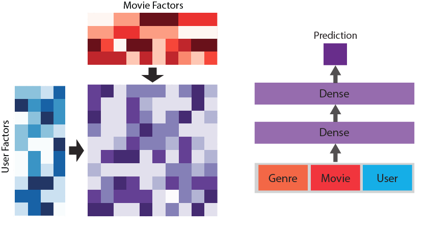

# recommender-systems

[](https://nbviewer.jupyter.org/github/ilias-ant/recommender-systems/tree/main) [](https://github.com/psf/black) 

Implementing various Recommender Systems for [Amazon review data](https://nijianmo.github.io/amazon/index.html) as well as [MovieLens](https://grouplens.org/datasets/movielens/):

- [Content-Based RS](https://github.com/ilias-ant/recommender-systems/blob/main/content-based-RS.ipynb)
- [Collaborative Filtering RS](https://github.com/ilias-ant/recommender-systems/blob/main/collab-filtering-RS.ipynb)
- [Hybrid RS (combining the previous two)](https://github.com/ilias-ant/recommender-systems/blob/main/hybrid-RS.ipynb)
- [Deep-Matrix-Factorization-Based RS](https://github.com/ilias-ant/recommender-systems/blob/main/deep-learning-based-RS.ipynb)
- [Matrix-Factorization-Based RS with Federated Learning setting](https://github.com/ilias-ant/recommender-systems/blob/main/federated-learning-based-RS.ipynb)

This project was part of the course **Recommender Systems** at the MSc in Data Science of AUEB, carried out during the Winter Quarter 2021-22.



## Installation

To enable reproducibility, [Poetry](https://python-poetry.org/) has been used as a dependency manager.

```shell
python3 -m pip install poetry
```

and then:

```shell
python3 -m poetry install
```

## Reproduction

To run any of the available Jupyter notebooks, you can do so through your browser, after having initialized the Jupyter Notebook server with:

```shell
poetry run jupyter notebook
```

## Citation

For the Amazon review dataset:

```bibtex
@inproceedings{ni-etal-2019-justifying,
    title = "Justifying Recommendations using Distantly-Labeled Reviews and Fine-Grained Aspects",
    author = "Ni, Jianmo  and
      Li, Jiacheng  and
      McAuley, Julian",
    booktitle = "Proceedings of the 2019 Conference on Empirical Methods in Natural Language Processing and the 9th International Joint Conference on Natural Language Processing (EMNLP-IJCNLP)",
    month = nov,
    year = "2019",
    address = "Hong Kong, China",
    publisher = "Association for Computational Linguistics",
    url = "https://aclanthology.org/D19-1018",
    doi = "10.18653/v1/D19-1018",
    pages = "188--197",
}
```

For the Surprise library:

```bibtex
@article{Hug2020,
  doi = {10.21105/joss.02174},
  url = {https://doi.org/10.21105/joss.02174},
  year = {2020},
  publisher = {The Open Journal},
  volume = {5},
  number = {52},
  pages = {2174},
  author = {Nicolas Hug},
  title = {Surprise: A Python library for recommender systems},
  journal = {Journal of Open Source Software}
}
```

For the MovieLens dataset:

> F. Maxwell Harper and Joseph A. Konstan. 2015. The MovieLens Datasets: History and Context. ACM Transactions on Interactive Intelligent Systems (TiiS) 5, 4: 19:1–19:19. <https://doi.org/10.1145/2827872>